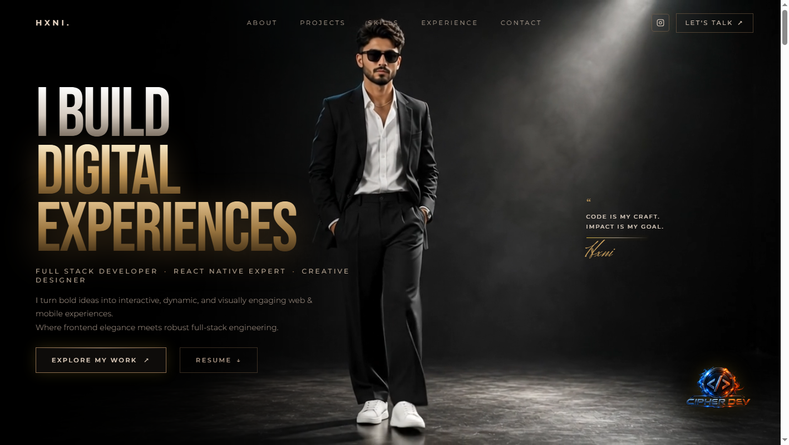

<div align="center">

  # 🎬 CINEMATIC LUXE PORTFOLIO

  <p align="center">
    <strong>A high-end, immersive, and motion-driven developer portfolio engineered with React 19, TypeScript, Tailwind CSS, and Framer Motion.</strong>
  </p>

  <p align="center">
    <a href="https://a-talking-cinematic-portfolio-yfq6.vercel.app/" target="_blank">
      
    </a>
    <a href="https://www.instagram.com/mr.mohanty1902" target="_blank">
      
    </a>
    <a href="https://www.linkedin.com/in/sanghars-mohanty-371996149" target="_blank">
      
    </a>
  <p align="center">
    <a href="https://a-talking-cinematic-portfolio-yfq6.vercel.app/" target="_blank">
      
    </a>
  </p>

</div>

---

## 🌟 Overview

**Cinematic Luxe Portfolio** is an editorial, dark-luxe personal website engineered for full-stack developers, mobile engineers, and creative technologists. Built around precision typography, gold-accented film noir aesthetics, and physics-driven spring animations, this platform provides an unforgettable visual showcase for projects and technical expertise.

---

## ✨ Key Features

- **🎥 Fixed Cinematic Video Layer**: High-definition video canvas with soft radial edge blending and floating insignia watermark.
- **✨ Fluid Custom Cursor**: Spring-interpolated custom cursor with magnetic hover detection and subtle ambient light.
- **🃏 3D Holographic Tilt Card**: Realistic perspective gyroscope cards featuring mouse-tracked raycast spotlight overlays and drifting spark embers.
- **📚 ScrollStack Project Deck**: Card-stacking layout that collapses and expands dynamically on scroll, highlighting architectural metrics, tech badges, GitHub repositories, and live demo endpoints.
- **🗂️ Architectural Bento Matrix**: Categorized tech matrix showcasing Creative 3D/Frontend, Full-Stack & Mobile, Databases, and Core Engineering.
- **🗺️ Interactive Route Timeline**: Animated SVG milestone progress line tracking career milestones and education.
- **📟 Monolith Dispatch Terminal**: Minimalist contact terminal with immediate status notifications, email triggers, and social channels.
- **⚡ Ultra-Lightweight & Fast**: Built on Vite 8 and React 19 with sub-second production builds.

---

## 🛠️ Tech Stack

| Domain | Technology |
| :--- | :--- |
| **Core Framework** | [React 19](https://react.dev/) + [TypeScript](https://www.typescriptlang.org/) |
| **Build Tooling** | [Vite 8](https://vitejs.dev/) |
| **Styling & Design System** | [Tailwind CSS v4](https://tailwindcss.com/) + PostCSS |
| **Animation Engine** | [Framer Motion](https://www.framer.com/motion/) |
| **Smooth Scrolling** | [Lenis](https://lenis.darkroom.engineering/) |
| **Typography** | Bebas Neue, Montserrat, Herr Von Muellerhoff, Cinzel |

---

## 📁 Project Structure

```text
cinematic-portfolio/
├── public/
│   ├── videos/
│   │   └── hero.mp4            # Hero section background video
│   ├── favicon.svg             # Website favicon
│   └── icons.svg               # SVG asset bundle
├── src/
│   ├── assets/
│   │   ├── about.png           # 3D portrait image
│   │   ├── hero.png            # Hero fallback image
│   │   └── watermark.png       # Insignia watermark
│   ├── components/
│   │   ├── HeroSection.tsx     # Hero banner, navigation & video canvas
│   │   ├── AboutSection.tsx    # 3D tilt portrait & biography metrics
│   │   ├── ProjectsSection.tsx # ScrollStack stacking project showcase
│   │   ├── SkillsSection.tsx   # Bento grid tech matrix
│   │   ├── ExperienceSection.tsx# Scroll-animated milestone timeline
│   │   ├── ContactSection.tsx  # Terminal dispatch form & social links
│   │   ├── ScrollStack.tsx     # Reusable card-stacking engine
│   │   └── ScrollStack.css     # Stacking physics styling
│   ├── App.tsx                 # Root application wrapper
│   ├── index.css               # Global styling & Tailwind directives
│   └── main.tsx                # Application bootstrap
├── index.html                  # HTML entry with custom typography
├── package.json                # Project dependencies and build scripts
└── vite.config.ts              # Vite configuration
```

---

## 🚀 Getting Started

### Prerequisites

Ensure you have **Node.js** (v18 or higher) and **npm** installed on your system:

```bash
node -v
npm -v
```

### Installation

1. **Clone the repository**:
   ```bash
   git clone https://www.linkedin.com/in/sanghars-mohanty-371996149/cinematic-portfolio.git
   cd cinematic-portfolio
   ```

2. **Install dependencies**:
   ```bash
   npm install
   ```

3. **Start the development server**:
   ```bash
   npm run dev
   ```
   Open your browser and navigate to `http://localhost:5173/`.

### Production Build

To compile a minified production build:

```bash
npm run build
```

To preview the production build locally:

```bash
npm run preview
```

---

## 🎨 Customization

### 1. Changing Personal Information
- **Name & Branding**: Edit `src/components/HeroSection.tsx` and `src/components/AboutSection.tsx`.
- **Projects**: Update the `projects` array in `src/components/ProjectsSection.tsx`.
- **Skills**: Customize `bentoCategories` in `src/components/SkillsSection.tsx`.
- **Timeline / Experience**: Modify `journey` in `src/components/ExperienceSection.tsx`.
- **Contact & Socials**: Update URLs and email in `src/components/ContactSection.tsx` and `src/components/HeroSection.tsx`.

### 2. Replacing Background Video
Replace `public/videos/hero.mp4` with any high-definition MP4 clip. For optimal performance, keep video size under 5MB.

---

## 👤 Credits & Author

Personalized and maintained by **Sanghars Mohanty**.

- 🌐 **Live Website**: [a-talking-cinematic-portfolio-yfq6.vercel.app](https://a-talking-cinematic-portfolio-yfq6.vercel.app/)
- 📸 **Instagram**: [@mr.mohanty1902](https://www.instagram.com/mr.mohanty1902)
- 💻 **GitHub**: [@sanghars-mohanty](https://www.linkedin.com/in/sanghars-mohanty-371996149)
- 💼 **LinkedIn**: [sanghars-mohanty](https://www.linkedin.com/in/sanghars-mohanty-371996149)
- ✉️ **Email**: [sangharsmohanty59@gmail.com](mailto:sangharsmohanty59@gmail.com)

---

## 📄 License

This project is open source and available under the [MIT License](LICENSE).
